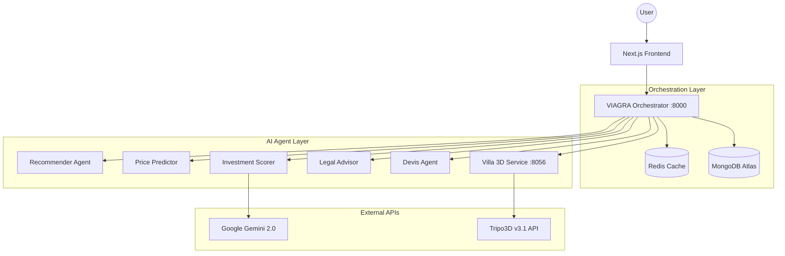

# EstateMind Technical Architecture

## 1. System Overview
EstateMind is a premium AI-powered real estate platform designed for the Tunisian market. It integrates advanced machine learning models and generative AI to provide users with deep insights into property investments, price predictions, and architectural visualization.

### 1.5 User Journey Scenario
A typical user journey on EstateMind involves several interconnected agents:
1. **Discovery**: A user searches for "Appartement à La Marsa budget 400k". The **VIAGRA Orchestrator** detects the intent, calls the **Recommender Agent** for listings and the **Geo Advisor** for neighborhood insights.
2. **Analysis**: The user selects a listing. The **Investment Scorer** calculates the yield and ROI, while **Gemini** generates a "Buy/Hold/Avoid" report.
3. **Visualization**: The user wants to see how a villa would look on a specific terrain. They upload a photo. The **Villa 3D Service** generates a 2D render via **Stable Diffusion** and then a 3D interactive model via **Tripo3D**.
4. **Finalization**: The user asks about legal fees. The **Legal Advisor** provides a precise response based on Tunisian law.

## 2. Technology Stack
- **Frontend**: Next.js 14+, Tailwind CSS, Lucide Icons, Framer Motion, `model-viewer` (3D).
- **Orchestrator (VIAGRA)**: FastAPI (Python), Httpx, Redis (Caching), MongoDB Atlas.
- **AI Agents**:
    - **Price Predictor**: ML regression model + Heuristics.
    - **Investment Scorer**: ROI calculation + Gemini 2.0 Flash analysis.
    - **Legal Advisor**: RAG (Retrieval-Augmented Generation) on Tunisian law.
    - **Devis/Cost Agent**: Construction & Renovation estimation.
    - **Villa 3D**: Stable Diffusion v1.5 (LoRA fine-tuned) + Tripo3D v3.1 API.
- **Database**: MongoDB Atlas (Listing data), Redis (Response caching).

## 3. Site Architecture

## 4. Agent Architecture (Detailed)

### A. VIAGRA (Versatile Intelligent Gateway for Real-Estate AI Agents)
The central hub of the system. It handles:
- **Intent Classification**: Routing user queries to the correct agent.
- **Language Detection**: Supporting Arabic, French, and English.
- **Parallel Execution**: Calling multiple agents simultaneously for faster response times.
- **Caching**: Storing expensive agent results in Redis.

### B. Investment Scanner Agent
- **Data Flow**: Scans MongoDB for listings -> Calculates financial metrics (ROI, Yield, Appreciation) -> Ranks via Heuristic Scoring -> Generates summary via Gemini.
- **Logic**: Uses region-specific appreciation rates (e.g., 7% for Nabeul, 6% for Tunis).

### C. Villa 3D Pipeline
1. **2D Generation**: Uses Stable Diffusion v1.5 with a custom LoRA trained on high-end Tunisian villa designs.
2. **3D Conversion**:
    - **Direct**: Image-to-model via Tripo3D v3.1.
    - **Multiview**: Generates 4 orthographic views before reconstruction for superior geometry.
    - **Text-to-3D**: Direct generation from architectural descriptions.

## 5. Component Relations
1. **Frontend <-> Orchestrator**: RESTful API calls. The frontend uses a subscription-based guard for premium features.
2. **Orchestrator <-> MongoDB**: Real-time listing retrieval and market analysis.
3. **Orchestrator <-> Agents**: HTTP/JSON invocation. Agents are stateless and return structured reports.
4. **Villa 3D <-> Frontend**: Base64 encoded GLB models for instant preview via Google's `<model-viewer>`.

---
*Last Updated: 2026-05-04*
